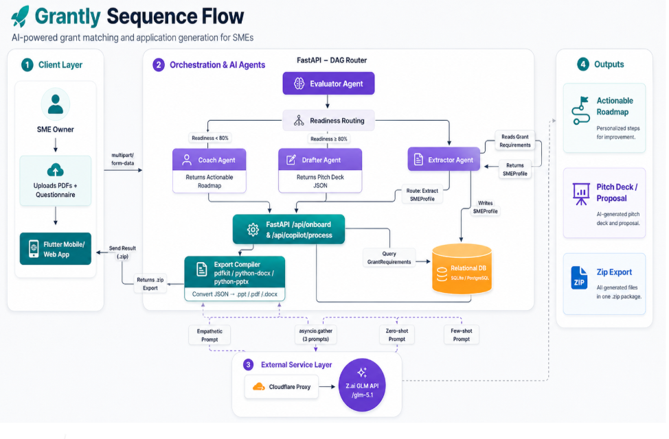

<div align="center" style="padding-bottom:20px;padding-top:20px">
  
  <p align="center">
    <em>The Malaysia SME Grant Copilot: discover grants, measure readiness, and generate submission-ready documents.</em>
  </p>
</div>

<div align="center">
  
  
  
  
  
  
  
  
</div>

---

##  ✅ Submission Link

1. Refined QATD: <https://drive.google.com/file/d/1ixN4gdK9kUuULFavjp8myOdU3z8Gx1Ws/view?usp=sharing>

2. Deployment Plan: <https://drive.google.com/file/d/1TQKVW4sd0XbLbwYlb4OwELTEPzorT0De/view?usp=sharing>

3. Business Proposal: <https://drive.google.com/file/d/1rfDstG5xx9VYY1uHQhXTKtPA7XS8KHNw/view?usp=sharing>

4. Pitch Deck: <https://drive.google.com/file/d/1NFgphPY-yU77c0Le5iNELzJieu9LrpII/view?usp=sharing>

---

## Repository Overview & Team Introduction

**Grantly** is a monorepo containing a **Next.js web application** and a **FastAPI multi-agent backend**. It helps Malaysian SMEs move from "I do not know which grant I qualify for" to a clear application package with matched grants, readiness scoring, missing-document coaching, generated proposals, and downloadable pitch decks.

**The Team:**
* **[Look Kai Yang]** - Project Lead / Backend Engineer
* **[Marcus Wong Shi Quan]** - Data Engineer
* **[Steve Hein Yu Xuan]** - AI Architect
* **[Chiang Cheng Han]** - Frontend Engineer / UIUX Engineer
* **[Liew Wei Hong]** - Frontend Engineer

**Pitching Video:** <https://drive.google.com/file/d/1QT3Tu9hYjgq3E0xCWWQ--wcqB4arAUGI/view?usp=sharing>

---

## The Problem

For many Malaysian SMEs, grant funding is not blocked by lack of ambition. It is blocked by fragmented information, unclear eligibility rules, and application paperwork that takes time away from running the business.

The current grant journey creates several painful gaps:

* **Scattered Opportunities**: Grants live across government, agency, and private-sector websites. SMEs may miss suitable funding simply because they never find it.
* **Eligibility Ambiguity**: Founders often cannot tell whether their company profile, sector, nationality, revenue, project cost, or document set matches a grant.
* **Document Readiness Stress**: Requirements such as SSM certificates, audited financial statements, BOD resolutions, integrity declarations, proposals, and pitch decks are easy to misread or forget.
* **High Preparation Cost**: Even when an SME is eligible, writing a polished proposal or pitch deck can require outside consultants.
* **Manual Portal Submission**: Official grant portals still require human review and submission, so the best AI support is a copilot that prepares a brief roadmap and a clean package rather than pretending to bypass official checks.

---

## Our Solution

Grantly turns the grant process into a guided pipeline: **profile, match, prepare, package, submit**. It does not just list grants. It evaluates a company against each grant, explains readiness, coaches missing evidence, and drafts the soft documents an SME can reasonably generate.

### Core Features & Agentic Pillars

1. **Hybrid Onboarding with the Extractor Agent**  
   Users answer a short questionnaire and upload business documents such as SSM certificates, financial statements, or existing pitch material. The Extractor Agent normalizes these inputs into a structured SME profile.

2. **Grant Discovery with the Scout Agent**  
   The Scout Agent ingests curated and crawlable grant sources, extracts open grant opportunities, normalizes provider details, funding amounts, eligibility notes, deadlines, and requirements, then transfer these unstructured data into well-structured information body and stores them in the grant database.

3. **Explainable Matching with the Evaluator Agent**  
   The Evaluator ranks grants using suitability and readiness scores. Each result includes evidence traces such as sector fit, funding cap fit, nationality fit, and missing required documents.

4. **Readiness Coaching for Unready SMEs with the Coach Agent**  
   If readiness is below the configured threshold, the Coach explains what each missing hard document is, why it matters, and how the founder can obtain it in Malaysia.

5. **Application Drafting for Ready SMEs with the Drafter Agent**  
   The Drafter Agent generates business proposal content, presentation scripts, and pitch deck material. The backend can also render `.pptx` decks and store generated documents against the user's application.

6. **Submission Package Assembly**  
   Grantly bundles company profile evidence, uploaded hard documents, generated soft documents, manifests, and pitch decks into a downloadable ZIP package for manual submission through the official grant portal.

---

## System Architecture

Grantly uses a separated frontend and backend architecture with shared API contracts.



### The Three Core Application Loops

1. **Onboarding & Profile Loop**
   * User signs in, answers business fundamentals, and adds company documents.
   * Backend stores a normalized SME profile, document metadata, readiness score, and system state.
   * API path: `/users/{user_id}/company-profile/extract`.

2. **Grant Matching & Readiness Loop**
   * Scout keeps the grant database fresh from curated and web sources.
   * Evaluator compares the SME profile against grants and produces suitability scores, readiness levels, and evidence traces.
   * API paths: `/grants/scout/*`, `/grants/match/{user_id}`, `/grants/{grant_id}/application/{user_id}`.

3. **Application Preparation Loop**
   * Coach handles missing hard documents when the user is not ready.
   * Drafter generates soft documents such as proposals, pitch decks, and scripts when the user is ready.
   * Backend stores generated outputs and builds the final submission ZIP.
   * API paths: `/documents/upload`, `/documents/generate`, `/pitch-deck/generate`, `/draft`, `/package`.

---

## Tech Stack & Engineering

### Frontend: SME Grant Workspace

  

* **Framework**: Next.js App Router with React and TypeScript.
* **Main Screens**: Landing page, login, onboarding, business fundamentals, document vault, and dashboard tabs for Home, Grants, Company, Roadmaps, and Team.
* **API Layer**: `frontend/src/services/grantlyApi.ts` centralizes backend contracts, downloads, user workspace hydration, grant application flow, and Scout/Drafter calls.
* **Auth Layer**: Firebase web auth is configured through `frontend/src/lib/firebase.ts`.

### Backend: FastAPI Grant Pipeline

 

* **Framework**: FastAPI with typed Pydantic request and response schemas.
* **Persistence**: SQLAlchemy models backed by local SQLite at `backend/grantly.db`.
* **Routes**: User onboarding and workspace APIs live in `backend/src/routes/profiles.py`; grant, Scout, application, document generation, and package APIs live in `backend/src/routes/grants.py`.
* **Scoring**: `backend/src/core/dag_router.py` computes profile readiness, grant fit, checklist status, and the Coach/Drafter branch.

### AI & Agent Layer


* **Extractor Agent**: Generates structured SME profile fields from questionnaire answers and document evidence.
* **Scout Agent**: Extracts grant records from curated files and configured sources, with fallback parsing when LLM extraction is unavailable.
* **Evaluator Agent / Logic**: Produces readiness scores and auditable evidence traces.
* **Coach Agent**: Converts missing requirements into practical next steps for Malaysian SMEs.
* **Drafter Agent**: Produces grant proposals, pitch deck outlines, speaking scripts, critiques, and stored `.pptx` outputs.

---

## Impact

Grantly supports **SDG 8 (Decent Work and Economic Growth)**, **SDG 9 (Industry, Innovation and Infrastructure)**, and **SDG 10 (Reduced Inequalities)** by making funding access easier for smaller businesses.

1. **For SMEs**: Reduces confusion, saves preparation time, and gives founders a practical readiness roadmap.
2. **For Grant Providers**: Encourages more complete, better-structured submissions with clearer supporting evidence.
3. **For the Ecosystem**: Helps public and private funding reach companies that may otherwise be excluded by information and paperwork barriers.

---

## Challenges Faced

* **Unstructured Grant Data**: Grant pages vary widely in format, deadline wording, eligibility criteria, and document descriptions. Grantly handles this with curated source ingestion, normalization, and fallback extraction.
* **Readiness vs. Suitability**: A company can be a strong business fit but still be blocked by missing documents. The system separates suitability score from readiness score so users understand both.
* **Hard Docs vs. Soft Docs**: Some requirements must be uploaded by the company, while others can be generated. Grantly models these as `attached` and `generated` requirements.
* **Safe Submission Boundary**: The app prepares a clean package but leaves official portal submission to the user because human verification and final legal responsibility belong with the applicant.

---

## Getting Started & Installation

### 1. Clone and Enter the Project

```powershell
cd Grantly
```

### 2. Backend Setup (FastAPI)

The backend requires Python 3.10+.

```powershell
python -m venv .venv
.\.venv\Scripts\Activate.ps1
pip install -r backend\requirements.txt
```

Create a `.env` file in the project root. You can start from `.env.example`:

```env
CLAUDE_SONNET_API_KEY=your_anthropic_claude_api_key
CLAUDE_SONNET_MODEL=claude-sonnet-4-5-20250929
OPENROUTER_GEMINI_API_KEY=your_openrouter_gemini_api_key
OPENROUTER_GEMINI_MODEL=google/gemini-2.5-flash
OPENROUTER_FALLBACK_ENABLED=true
GOOGLE_API_KEY=your_google_ai_studio_api_key
GEMINI_MODEL=gemini-2.5-flash
GEMINI_BASE_URL=https://generativelanguage.googleapis.com/v1beta
ZAI_API_KEY=your_zai_api_key
ZAI_FALLBACK_ENABLED=true
ZAI_BASE_URL=https://api.ilmu.ai/v1
ZAI_MODEL=ilmu-glm-5.1
SCOUT_SOURCE_FILE=backend/data/scout_sources.json
NEXT_PUBLIC_BACKEND_BASE_URL=http://localhost:8000
```

Run the API server:

```powershell
.\.venv\Scripts\python.exe -m uvicorn backend.main:app --reload --port 8000
```

Backend health check:

```http
http://localhost:8000/
```

Interactive API docs:

```http
http://localhost:8000/docs
```

### 3. Frontend Setup (Next.js)

```powershell
npm --prefix frontend install
npm --prefix frontend run dev
```

Then open:

```http
http://localhost:3000
```

### 4. Useful Local Commands

```powershell
# Build frontend
npm run build

# Run frontend lint
npm run lint

# Test Claude primary / Gemini fallback from the backend agent package
.\.venv\Scripts\python.exe -m backend.ai_sandbox.test_gemini_key
```

---

## API Quick Reference

### Users & Profiles

* `POST /users` - create a user
* `GET /users/lookup` - find a user by email or external auth id
* `GET /users/{user_id}/workspace` - load profile, documents, ranked grants, and grant library
* `PUT /users/{user_id}/company-profile` - upsert a normalized company profile
* `POST /users/{user_id}/company-profile/extract` - run hybrid onboarding and Extractor flow
* `GET /users/{user_id}/documents` - list uploaded and generated documents

### Grants & Applications

* `GET /grants` - list grants
* `POST /grants` - create a grant record
* `GET /grants/match/{user_id}` - rank grants for an SME profile
* `GET /grants/{grant_id}/application/{user_id}` - load checklist, readiness, Coach/Drafter branch, and downloads
* `POST /grants/{grant_id}/application/{user_id}/documents/upload` - upload a hard document
* `POST /grants/{grant_id}/application/{user_id}/documents/generate` - generate a soft document
* `POST /grants/{grant_id}/application/{user_id}/pitch-deck/generate` - generate and store a PPTX pitch deck
* `GET /grants/{grant_id}/application/{user_id}/package` - download the submission ZIP

### Scout

* `POST /grants/scout/start` - start Scout in the background
* `POST /grants/scout/stop` - request Scout stop
* `GET /grants/scout/status` - inspect Scout state
* `POST /grants/scout/run` - run curated Scout synchronously
* `GET /grants/scout/last-report` - read the latest Scout report
* `GET /grants/scout/source-health` - check configured source health

---

## Future Roadmap

* **Production Auth Hardening**: Complete Firebase or Clerk-backed auth flows with protected backend identity mapping.
* **Cloud Storage for Uploaded Documents**: Move hard-document binaries from local/demo metadata into secure object storage.
* **Scheduled Scout Runs**: Run the Scout Agent on a controlled schedule with source health monitoring and expired-grant pruning.
* **Editable Generated Documents**: Let users review, revise, and approve proposals and pitch decks before packaging.
* **Government & Agency Integrations**: Where APIs exist, push prepared metadata directly into official grant systems while keeping the human-in-the-loop submission boundary.

---

## Project Structure

```text
Grantly/
  backend/
    ai_sandbox/        # Extractor, Scout, Coach, Drafter, PPTX generation
    data/              # Scout sources and run reports
    src/
      api/             # Pydantic API schemas
      core/            # Config and readiness/matching logic
      database/        # SQLAlchemy models and DB helpers
      routes/          # FastAPI route modules
    main.py
  frontend/
    src/
      app/             # Next.js pages and dashboard tabs
      lib/             # Firebase setup
      services/        # Backend API and session services
  docs/                # Product, API, and execution notes
```
